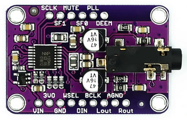
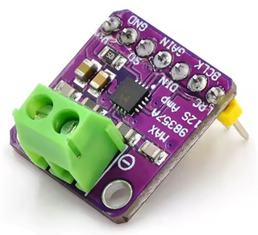

## CYD_Internetradio with the ESP32-2432S028R (Cheap Yellow Display)
Because the CYD (Cheap Yellow Display) already has a display, it makes 
sense to realize a graphical user interface with touch input for the 
[Simplest Internet Radio](https://github.com/Carlo47/CYD_Simplest_InternetRadio) 
presented a earlier.

### Graphical User Interface
The user interface should offer the following options:
- Display of time and date
- Display of metadata such as composer and music title
- Display of the number and station name
- Volume adjustment via slider
- Navigation through the predefined station list
- Saving the preferred station and volume

 Graphical User Interface


To be able to display umlauts in German metadata, a character set is 
required that also contains the characters from 128 to 255. Such a 
font can easily be created from any ttf font with the program 
[fontconvert](https://github.com/KrisKasprzak/FontConvert/blob/main/FontConvert.zip) 
and ttf fonts are found under Windows in the font directory. 
But any existing copyright must be respected!

```                                        
                                        size first last  destination
fontconvert c:\windows\fonts\calibri.ttf 8    32    255 > calibri.h
```

The designed user interface soon worked as desired. But as soon as I 
activated the code for the radio, the touch input was blocked. The reason 
was quickly found: The AnalogAudioStream outputs the analog signals of 
the built-in DAC to the GPIO_NUM 25 and GPIO_NUM_26 pins. Unfortunately 
the CYD uses GPIO_NUM_25 for the clock signal of the touch pad.

### External DAC
Therefore an external DAC must be used, e.g. PCM5102, VS1053B or the 
UDA1334A which I used for my stereo headphones. 

 UDA1334A

I wired the CYD and the UA1334 as shown in the table:

| Connector P3 | UA1334A |    ¦    | Connector CN1   | UA1334A |
|:------------:|:-------:|:-------:|:---------------:|:-------:|
|    IO 22     | DIN     |    ¦    | GND             | GND     |
|    IO 21     | WSEL    |    ¦    | IO 27           | BCLK    |
|              |         |    ¦    |    3.3V         | VIN     | 

### External Amplifier
If you want to connect 2 stereo speakers instead, you can use 
2 MAX98357 PCM Class D amplifiers. The stereo amplifiers must 
be wired with different resistor values for the left and right 
channels, see the description in the repository [ESP32Internetradio](https://github.com/Carlo47/ESP32InternetRadio).

 MAX98357A


### Log in to the WLAN
When the web radio is put into operation for the first time, the AutoConnectAP access point is started. Log in here with your cell phone and then enter the SSID and password of your router via the web browser at the URL 192.168.4.1. The login data is then saved permanently so that the web radio connects automatically in future.