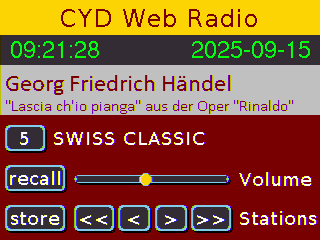

# CYD_Internetradio with the ESP32-2432S028R (Cheap Yellow Display)
Because the CYD (Cheap Yellow Display) already has a display, it makes 
sense to realize a graphical user interface with touch input for the 
simplest Internet radio presented a little earlier.

The designed user interface soon worked as desired. But as soon as I 
activated the code for the radio, the touch input was blocked. The reason 
was quickly found: The AnalogAudioStream outputs the analog signals of 
the built-in DAC to the GPIO_NUM 25 and GPIO_NUM_26 pins. Unfortunately 
the CYD uses GPIO_NUM_25 for the clock signal of the touch pad and 
therefore an external DAC must be used, e.g. Max98357, VS1053B or the 
UDA1334A which I used for my stereo headphones.

I wired the CYD and the UDA1334 as shown in the table:

| Connector P3 | UDA1334A |
|:------------:|:--------:|
|    IO 22     | DIN      |
|    IO 21     | WSEL     |

| Connector CN1 | UDA1334A |
|:-------------:|:--------:|
|    GND        | GND      |
|    IO 27      | BCLK     |
|    3.3V       | VIN      |
